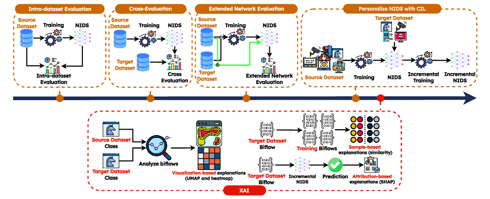

# Adaptable, Incremental, and Explainable Network Intrusion Detection Systems for Internet of Things
## Code and Data

This repo contains the code and (a sample of) the data leveraged in the work named **"Adaptable, Incremental, and Explainable Network Intrusion Detection Systems for Internet of Things"**, _Engineering Applications of Artificial Intelligence (EAAI)_, Elsevier.



DOI: https://doi.org/10.1016/j.engappai.2025.110143

## Abstract

The growing adoption of Internet of Things (IoT) devices expands the cybersecurity landscape and complicates the protection of IoT environments. Therefore, Network Intrusion Detection Systems (NIDSs) have become essential. They are increasingly using Machine and Deep Learning (ML and DL) techniques for detecting and mitigating sophisticated cyber threats.

However, the black-box nature of these systems hinders adoption, emphasizing the need for eXplainable Artificial Intelligence (XAI) to clarify decision-making. Additionally, IoT networks require adaptable NIDSs integrating new traffic types without retraining. This study integrates XAI with Class Incremental Learning (CIL) and Domain Incremental Learning (DIL) to improve NIDS transparency and adaptability. This work focuses on training NIDSs with traffic from a source network and extending it to a target network. For the sake of generalization, three recent and publicly available IoT security datasets are leveraged. Each dataset is collected in a different network setup and includes different attacks and benign profiles.

Key findings include: (i) NIDSs perform effectively within the source network (> 79% F1 score) but poorly in the target one (33% F1 score at least);(ii) adapting NIDSs incrementally is highly dependent on the source network traffic, with richer traffic complicating the adaptation. Incremental techniques help in adapting NIDSs (> 71% F1 score), with Fine-Tuning with Memory (FT-Mem) excelling for complex source networks and Bias Correction (BiC) for simpler ones;(iii) in terms of XAI, traffic characteristics significantly influence classification outcomes, and NIDS decisions are not based on minimal-distance logic.

## To Cite

```
@article{cerasuolo2025adaptable,
  title={Adaptable, incremental, and explainable network intrusion detection systems for internet of things},
  author={Cerasuolo, Francesco and Bovenzi, Giampaolo and Ciuonzo, Domenico and Pescap{\`e}, Antonio},
  journal={Engineering Applications of Artificial Intelligence},
  volume={144},
  pages={110143},
  year={2025},
  publisher={Elsevier}
}
```

## Code Description

`python3 main.py`

- `--exp-name` - the name of the experiment;
- `--results-path` - the path where results will be stored;
- `--datasets` - the couple of datasets to use, passed as `source target`; available datasets are: `edge_iot`, `iot_nidd`, and `ton_iot`;
- `--num-tasks` - number of training steps to perform, i.e., 1 for intra-dataset scenario and 2 for the extended evaluation;
- `--fields` - the packet fields to use as input; available fields are: `PL` (packet length), `IAT` (inter-arrival-time) `DIR` (packet direction), `WIN` (TCP window size);
- `--num-pkts` - the number of packets of biflows to take as input;
- `--batch-size` - the size of batches used for training the DL model;
- `--nepochs` - the maximum number of training epochs;
- `--save-models` - a flag that enable the saving of trained models;
- `--network` - the DL model to train;
- `--approach` - the learning approach for CIL and DIL; available approaches are: `scratch`, for training from scratch; `jointft`, for FT (Fine-Tuning) or FT-Mem (Fine-Tuning w/ Memory) when a memory is leveraged; `bic`, for BiC (Bias Correction);
- `--seed` - integer that sets the random seed used for train-test split and DL model initialization;
- `--num-exemplars` - the size of the leveraged memory; used with FT-Mem and BiC approaches.

## Examples of Usage

### Experiments Execution

Follow a list of commands that exemplifies the usage of the framework (launch them in the `./src/` folder).

#### Intra-dataset Scenario

```bash
# Intra-dataset training on Edge-IIoT
# Approach: Scratch
python3 main.py --exp-name intra_edge-iot --results-path ../results/ --datasets edge_iot --num-tasks 1 --fields PL IAT DIR WIN --num-pkts 10 --batch-size 64 --nepochs 10 --save-models --network Lopez17CNN --approach scratch --seed 1
```

#### Extendend Scenario

```bash
# Source network: IoT-NID; Target network: TON_IoT
# Approach: Scratch
python3 main.py --exp-name src_iot-nidd_dst_ton-iot --results-path ../results/ --datasets iot_nidd ton_iot --fields PL IAT DIR WIN --num-pkts 10 --batch-size 64 --nepochs 10 --save-models --network Lopez17CNN --approach scratch --seed 1
```

```bash
# Source network: IoT-NID; Target network: TON_IoT
# Approach: FT
python3 main.py --exp-name src_iot-nidd_dst_ton-iot --results-path ../results/ --datasets iot_nidd ton_iot --fields PL IAT DIR WIN --num-pkts 10 --batch-size 64 --nepochs 10 --save-models --network Lopez17CNN --approach jointft --seed 1
```

```bash
# Source network: IoT-NID; Target network: TON_IoT
# Approach: FT-Mem
python3 main.py --exp-name src_iot-nidd_dst_ton-iot --results-path ../results/ --datasets iot_nidd ton_iot --fields PL IAT DIR WIN --num-pkts 10 --batch-size 64 --nepochs 10 --save-models --network Lopez17CNN --approach jointft --seed 1 --num-exemplars 100
```

```bash
# Source network: IoT-NID; Target network: TON_IoT
# Approach: BiC
python3 main.py --exp-name src_iot-nidd_dst_ton-iot --results-path ../results/ --datasets iot_nidd ton_iot --fields PL IAT DIR WIN --num-pkts 10 --batch-size 64 --nepochs 10 --save-models --network Lopez17CNN --approach bic --seed 1 --num-exemplars 100
```

### Computing Metrics

The following commands compute the per-class metrics of each experiment (launch them in the `./src/` folder).

```bash
# Approach: Scratch
python3 compute_metrics.py --exp-name scratch --results-path ../results/ --yes
```

```bash
# Approach: FT
python3 compute_metrics.py --exp-name jointft --results-path ../results/ --yes
```

```bash
# Approach: FT-Mem
python3 compute_metrics.py --exp-name jointft-mem --results-path ../results/ --yes
```

```bash
# Approach: BiC
python3 compute_metrics.py --exp-name bic-mem --results-path ../results/ --yes
```

The excution of such commands generates the per-class metrics file in the `results` folder of each experiment. These files of metrics end with `_per_class_metrics.parquet`.

N.B. The results slightly differ from those in the paper since provided results refer to models trained on datasets downsampled at 10% and for a limited number of epochs (namely, 10).

### XAI Pipeline

#### Input Importance w/ SHAP

Execute cells in the notebook named `shap.ipynb`.

N.B. The results slightly differ from those in the paper since provided results refer to models trained on datasets downsampled at 10% and for a limited number of epochs (namely, 10).

#### Assess Similarity Within Datasets

Execute cells in the notebook named `umap_attacks.ipynb`.

N.B. The results slightly differ from those in the paper since provided results refer to models trained on datasets downsampled at 10% and for a limited number of epochs (namely, 10).

#### Sample-based Explanation and SHAP

To compute the sample-based explanations, we first need to compute top-K neighbors for each sample in the incremental train set w.r.t. the memory. Todo this, launch the following commands (launch them in the `./src/xai` folder).

```bash
# Approach: Scratch
python3 compute_neighbors.py --exp-path ../../results/src_iot-nidd_dst_ton-iot_scratch/
```

```bash
# Approach: FT
python3 compute_neighbors.py --exp-path ../../results/src_iot-nidd_dst_ton-iot_jointft/
```

```bash
# Approach: FT-Mem
python3 compute_neighbors.py --exp-path ../../results/src_iot-nidd_dst_ton-iot_jointft-mem/
```

```bash
# Approach: BiC
python3 compute_neighbors.py --exp-path ../../results/src_iot-nidd_dst_ton-iot_bic-mem/
```

Results files will be stored in the `neighbors/<exp-name>/` folder under `./src/xai`. Files are named `top-<k>_nb_src.np` from the source dataset, and `top-<k>_nb_tgt.np` from the target one.

After, to obtain analysis figures, execute cells in the notebook named `sample_explanations.ipynb`.

N.B. The results slightly differ from those in the paper since provided results refer to models trained on datasets downsampled at 10% and for a limited number of epochs (namely, 10).
